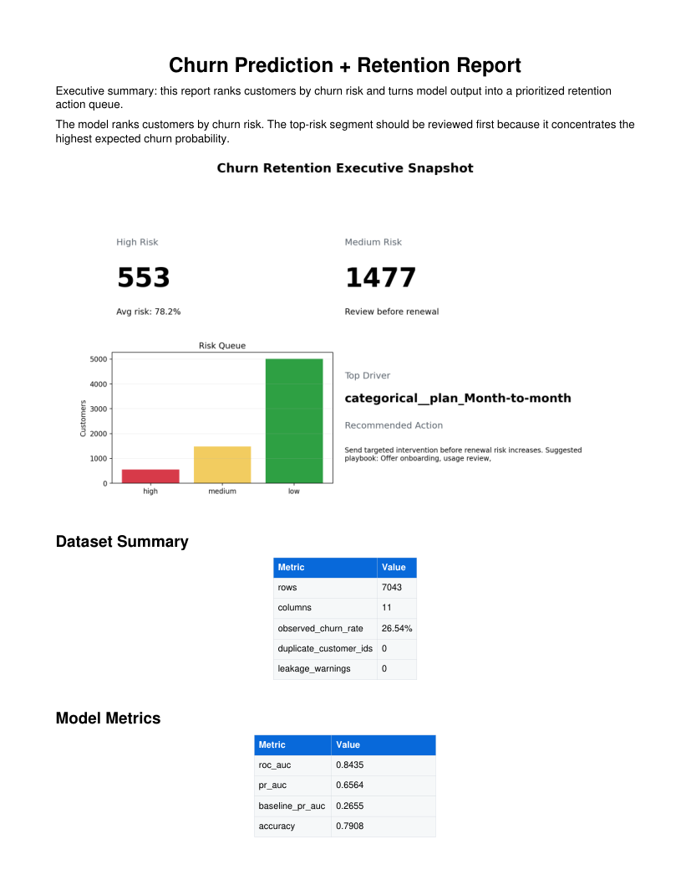
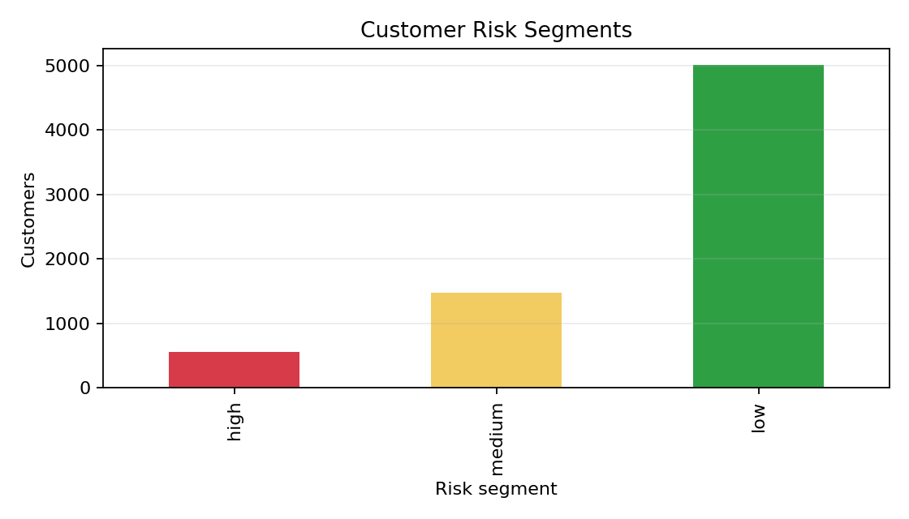
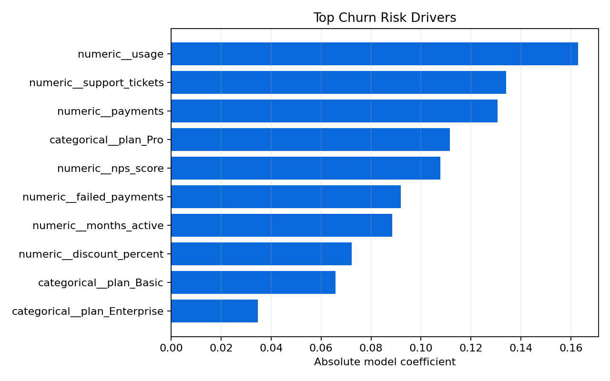
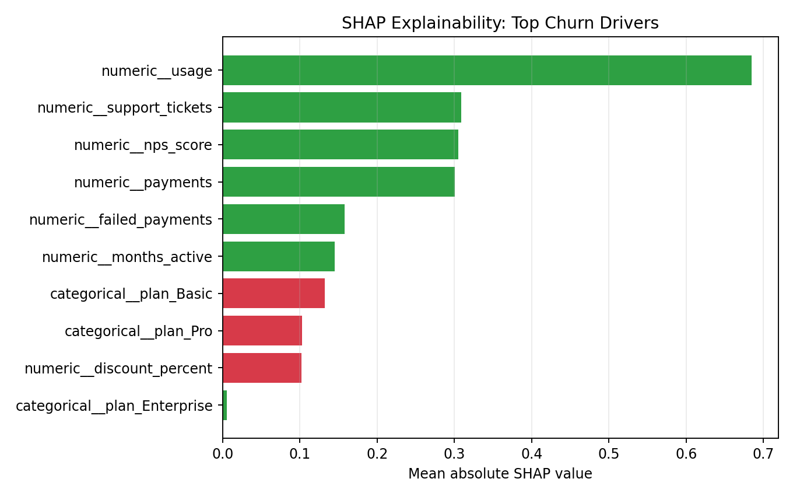
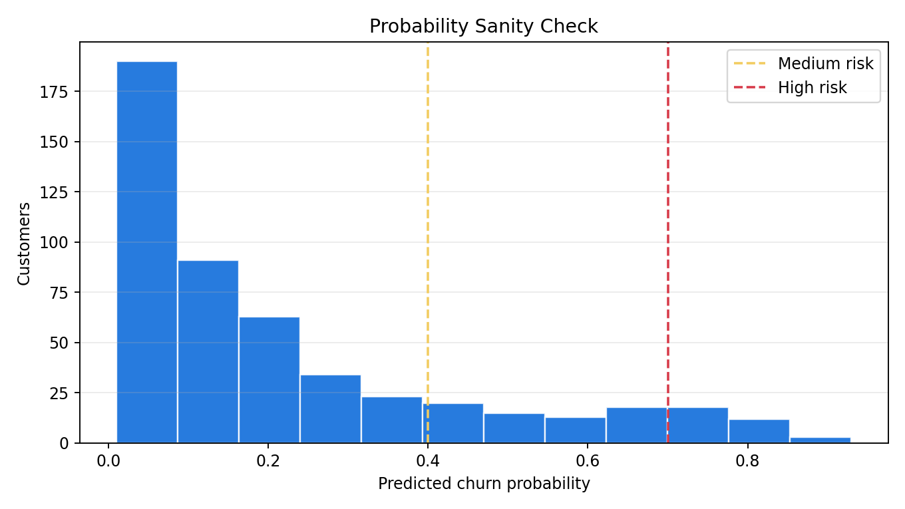
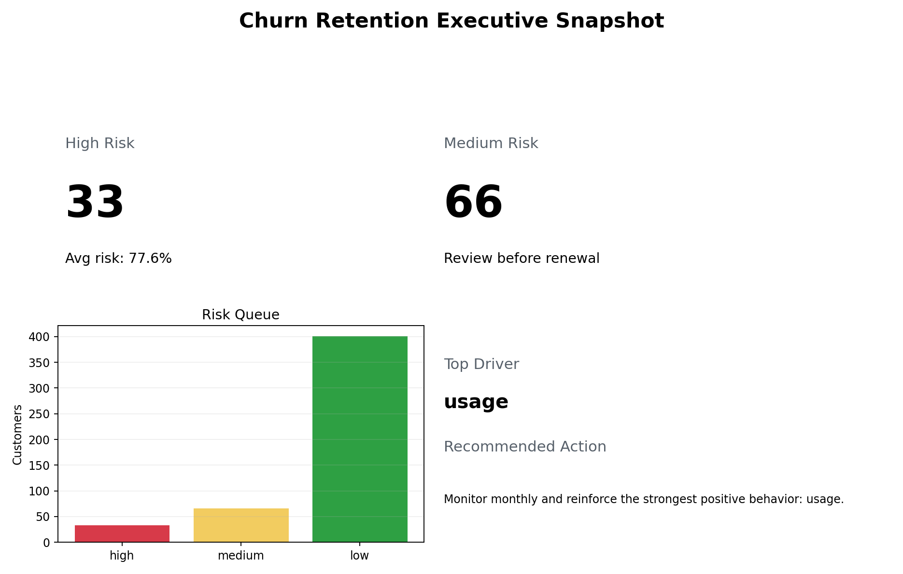

# Churn Prediction Retention Report

[](https://github.com/emirhuseynrmx/churn-prediction-retention-report/actions)
[](https://www.python.org/)

This is a production-style churn reporting pipeline.

The goal is simple: take a customer CSV, validate it, train a churn model, score
every customer, and export artifacts that make the model behavior inspectable.
It is not trying to be a full SaaS product, live dashboard, or MLOps platform.

The project is a portfolio-grade report pipeline: clean inputs, reproducible
config, validated outputs, a Typst-built PDF report, and an action queue for retention work.

## What It Produces

Given a customer file with columns like:

```text
customer_id, plan, usage, payments, support_tickets, churned
```

the pipeline writes:

- `predictions.csv`
- `risk_segments.csv`
- `holdout_lift_table.csv`
- `calibration_table.csv`
- `metric_confidence_intervals.csv`
- `feature_importance.csv`
- `shap_feature_importance.csv`
- `retention_recommendations.csv`
- `metrics_report.md`
- `data_quality_report.md`
- `model_card.md`
- `client_report.pdf` and `client_report.typ`
- `manifest.json`
- `config_snapshot.json`
- `risk_segments.png`
- `feature_importance.png`
- `shap_summary.png`
- `probability_distribution.png`
- `executive_dashboard.png`
- `model.joblib`

## Why I Built It This Way

Most churn projects should not stop at `customer_id, churn_probability`.

The useful output is a ranked retention queue:

```text
customer_id
churn_probability
risk_segment
likely_drivers
recommended_action
retention_priority
```

That is the part that turns model output into an operations-ready review queue.

The repo also includes the boring parts that make this kind of work safer:

- Pydantic config for column mapping and thresholds
- Pandera validation for inputs and exported CSVs
- minimum retained/churned class count checks
- risk threshold validation
- leakage warnings for suspicious post-churn columns
- XGBoost as the default model
- logistic regression fallback
- SHAP explanations with a logistic-regression fallback
- ROC AUC, PR-AUC, baseline PR-AUC, precision, recall, F1, confusion matrix
- holdout lift table with top 10% and top 20% churn capture
- holdout calibration table and bootstrap confidence intervals
- probability distribution sanity chart
- model card, config snapshot, output manifest
- Dockerfile for reproducible runs

## Run It

```bash
pip install -e ".[dev]"
churn-prepare-kaggle --out data/telco_customers.csv
churn-report data/telco_customers.csv --config examples/config.json --out outputs/telco_report
```

The public sample uses the Kaggle Telco Customer Churn dataset. Any replacement
dataset should follow the same contract: a customer id, a churn label, and
behavior or billing columns known before the churn event.

Docker:

```bash
docker build -t churn-retention-report .
docker run --rm -v "%cd%/outputs:/app/outputs" churn-retention-report
```

## Example Output

Sample outputs are committed under `sample_outputs/flagship_demo/` so the report shape is visible without running the code first.













## Output Contract

Every exported CSV is validated before export:

- `predictions.csv`: customer id, churn probability, risk segment
- `risk_segments.csv`: segment size and average risk
- `holdout_lift_table.csv`: decile-level churn capture and cumulative lift measured on the test split
- `calibration_table.csv`: predicted probability versus observed churn rate on the test split
- `metric_confidence_intervals.csv`: bootstrap intervals for ROC-AUC and PR-AUC
- `feature_importance.csv`: model feature importance
- `shap_feature_importance.csv`: SHAP attribution table
- `retention_recommendations.csv`: customer action queue with priority

## Project Notes

This package is for a one-time churn analysis and retention report from a provided CSV.

It does not include API deployment, CRM integration, scheduled retraining, database extraction, hosted dashboards, or guaranteed model accuracy. Those are separate scopes.

Private data should not be committed to a public repository. Sensitive columns
should be removed or anonymized before modeling.

## Docs

- [Architecture](docs/architecture.md)
- [Case Study](docs/case_study.md)
- [Client Intake Form](docs/client_intake_form.md)
- [Leakage Policy](docs/leakage_policy.md)
- [Scope And Privacy](docs/scope_and_privacy.md)
