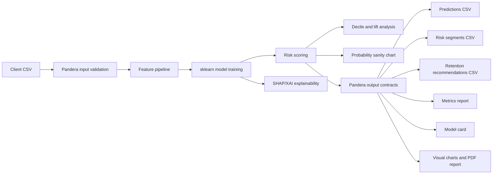

# Architecture

This repo is built as a client-ready churn prediction delivery pipeline, not a notebook.

## Design Principles

- Validate before modeling.
- Keep modeling, recommendations, reports, and contracts in separate modules.
- Treat every exported CSV as a product surface.
- Produce business-readable artifacts, not only technical metrics.
- Make every demo reproducible from source data, config, and seed.

## Module Map

- `schema.py`: validates the incoming customer dataset.
- `features.py`: keeps feature selection explicit and configurable.
- `modeling.py`: owns sklearn preprocessing, model training, and metrics.
- `recommendations.py`: converts risk scores into retention actions.
- `contracts.py`: validates client-facing CSV outputs with Pandera.
- `explainability.py`: builds SHAP/XAI attribution tables from the trained model.
- `quality.py`: detects missingness, duplicates, feature types, and leakage warnings.
- `pdf_report.py`: creates a client-ready PDF report.
- `artifacts.py`: writes the manifest, model card, and config snapshot.
- `visuals.py`: generates proof-of-work charts, SHAP visuals, and dashboard previews.
- `pipeline.py`: orchestrates the full delivery flow.

## Why This Structure Sells

Clients usually do not pay for a classifier alone. They pay for a decision workflow:

- Which customers are likely to churn?
- Why are they risky?
- What should we do next?
- Can the output be trusted enough to hand to a team?

This repo answers those questions with validated artifacts and visible proof of work.
